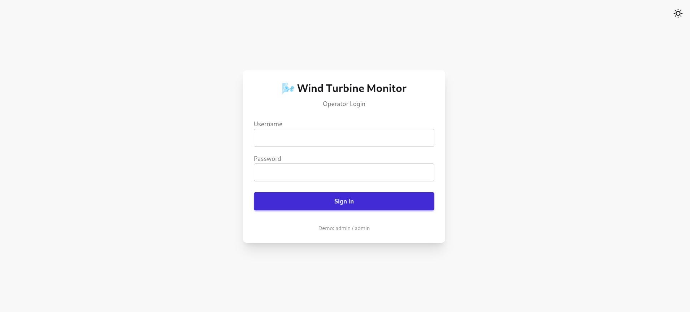
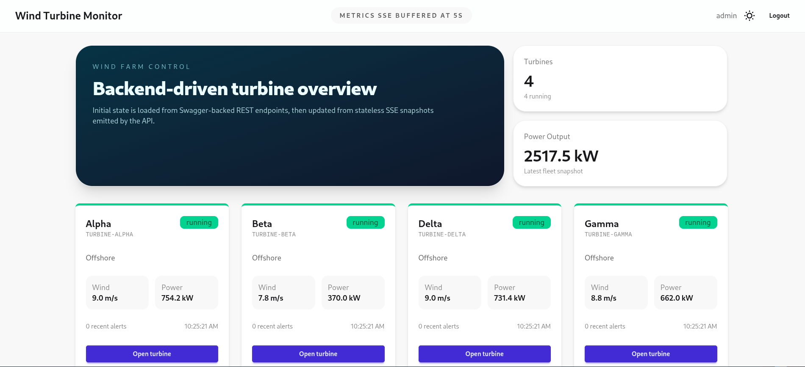
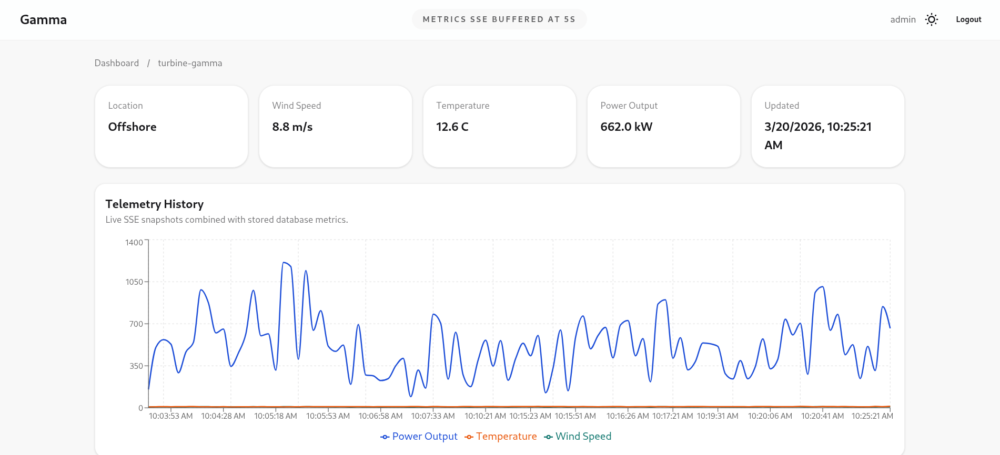
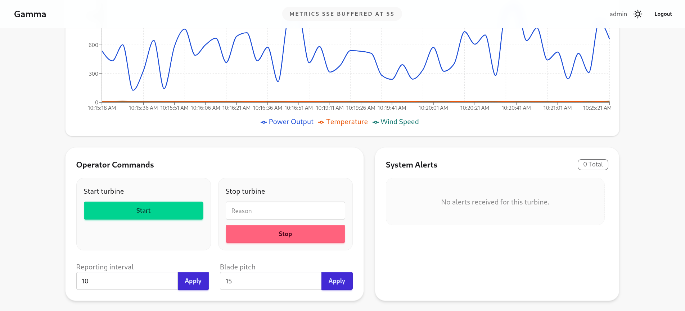
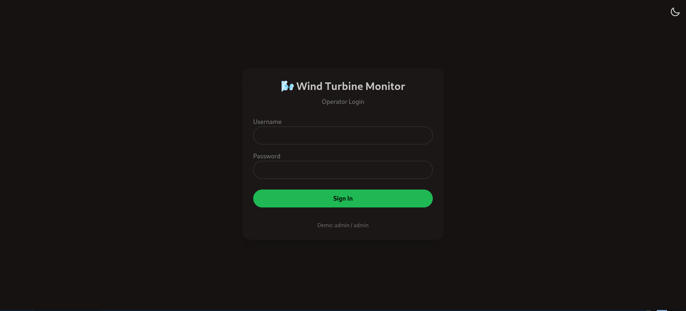
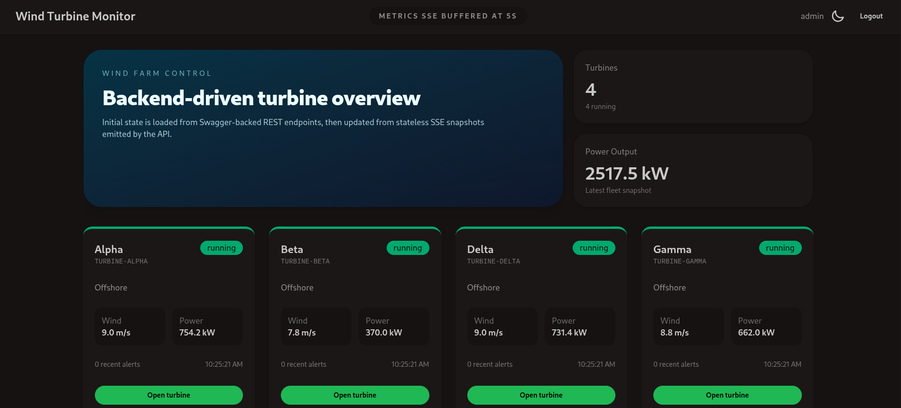
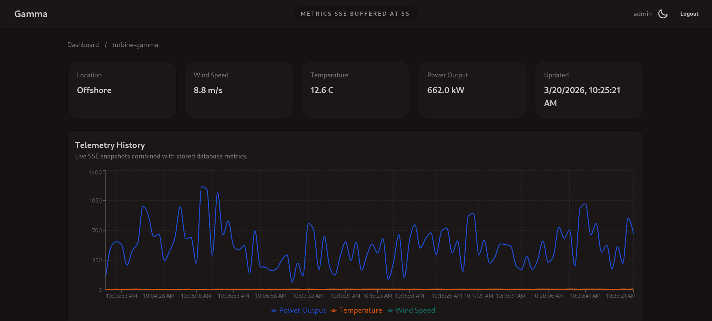
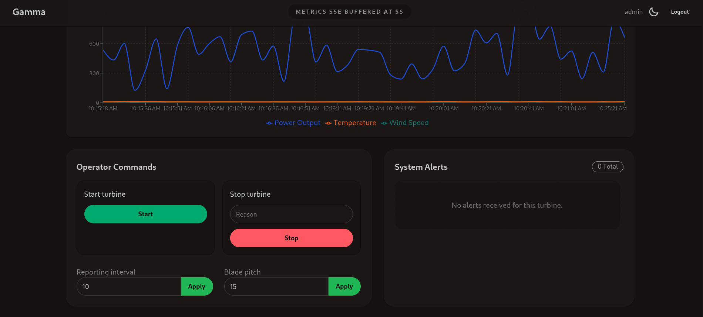

# Wind Turbine IoT Farm

Wind Turbine IoT Farm is a full-stack monitoring and control platform for a wind turbine farm.

The backend ingests live turbine telemetry over MQTT, stores metrics and alerts in PostgreSQL, exposes secured REST APIs, and streams near real-time updates to the frontend through Server-Sent Events (SSE). The frontend gives operators a dashboard, turbine detail views, alert visibility, and command controls for sending actions back to turbines through MQTT.

## Features

- Live turbine telemetry ingestion over MQTT
- Persistent storage of turbine metrics, alerts, and operator commands in PostgreSQL
- JWT-protected API for authenticated operator access
- Fleet dashboard with turbine overview cards
- Turbine details page with metric history charts and recent alerts
- Operator command panel for `start`, `stop`, `setPitch`, and `setInterval`
- SSE-based frontend updates for metrics and alerts
- Light and dark theme UI support

## Architecture

```text
Wind Turbines
    |
    v
MQTT Broker
    |
    v
ASP.NET Core API
    |-----------------------> PostgreSQL
    |
    +-----------------------> SSE / REST
                                 |
                                 v
                           React Frontend
```

## Tech Stack

### Backend

- .NET 10
- ASP.NET Core Web API
- Entity Framework Core
- PostgreSQL with Npgsql
- MQTTnet + `Mqtt.Controllers`
- Stateless SSE
- JWT authentication
- Swagger / OpenAPI

### Frontend

- React 19
- TypeScript
- Vite
- Tailwind CSS 4
- DaisyUI
- Axios
- Recharts

## Project Structure

```text
.
├── assets/                 # Light and dark theme screenshots
├── WindTurbineApi/         # ASP.NET Core backend
└── wind-turbine-ui/        # React frontend
```

## Screenshots

### Light Theme

#### Login



#### Dashboard



#### Metrics



#### Alerts



### Dark Theme

#### Login



#### Dashboard



#### Metrics



#### Alerts



## Backend Overview

The API is responsible for:

- receiving telemetry and alert events from MQTT topics
- creating turbine records when a new turbine appears
- storing telemetry as metric history
- storing alert messages for later review
- storing operator commands before publishing them to MQTT
- exposing REST endpoints for dashboard and turbine details
- streaming snapshot updates over SSE

### Main API Routes

Authentication:

- `POST /api/auth/login`

Turbines:

- `GET /api/turbines`
- `GET /api/turbines/{id}`
- `GET /api/turbines/{id}/metrics`
- `GET /api/turbines/{id}/alerts`

Commands:

- `POST /api/turbines/{turbineId}/commands`

Streaming:

- `GET /sse/metrics`
- `GET /sse/alerts`

Health:

- `GET /health`

### MQTT Topics

The backend subscribes to:

- `farm/{farmId}/windmill/+/telemetry`
- `farm/{farmId}/windmill/+/alert`

Commands are published to:

- `farm/{farmId}/windmill/{turbineId}/command`

The default farm ID in the current configuration is:

```text
6dc34e0e-30ad-4fde-9a2e-3a98b4ea9df7
```

## Frontend Overview

The frontend includes:

- login page with demo credentials
- protected routes
- fleet dashboard with summary stats
- turbine detail page
- command controls for turbine actions
- alert panel
- live SSE updates for metrics and alerts
- theme toggle for light and dark mode

## Authentication

The current login in the backend is a demo operator account:

```text
username: admin
password: admin
```

After login, the frontend stores the JWT token in local storage and sends it with API requests.

## Local Development

### 1. Start PostgreSQL

You can run PostgreSQL with Docker:

```bash
docker run -d \
  --name windturbine-db \
  -e POSTGRES_USER=admin \
  -e POSTGRES_PASSWORD=secret \
  -e POSTGRES_DB=WindTurbineDb \
  -p 5432:5432 \
  postgres:15
```

### 2. Configure the backend

The development connection string is already set in [appsettings.Development.json](/home/baron/Desktop/Easv/WindTurbine/WindTurbineApi/appsettings.Development.json).

Relevant backend settings:

- `ConnectionStrings:DefaultConnection`
- `Mqtt:Host`
- `Mqtt:Port`
- `Mqtt:FarmId`
- `Jwt:Key`
- `Jwt:Issuer`
- `Jwt:Audience`
- `Cors:AllowedOrigins`

### 3. Run the backend

```bash
cd WindTurbineApi
dotnet restore
dotnet run
```

The backend exposes Swagger at the app root, typically:

```text
http://localhost:5199/
```

Health endpoint:

```text
http://localhost:5199/health
```

### 4. Run the frontend

```bash
cd wind-turbine-ui
npm install
npm run dev
```

The frontend usually runs at:

```text
http://localhost:5173
```

If needed, set the API base URL for Vite:

```bash
VITE_API_URL=http://localhost:5199
```

## Database Data Model

The backend stores:

- `Turbines`
- `TurbineMetrics`
- `Alerts`
- `OperatorCommands`

This allows the platform to:

- preserve historical telemetry for charts
- preserve historical alerts for incident review
- audit operator-issued commands

## Database Configuration

### Connection String

The development backend currently uses this PostgreSQL connection string in [appsettings.Development.json](/home/baron/Desktop/Easv/WindTurbine/WindTurbineApi/appsettings.Development.json):

```text
Host=localhost;Port=5432;Database=WindTurbineDb;Username=admin;Password=secret
```

If you want to configure it manually, update:

- [appsettings.json](/home/baron/Desktop/Easv/WindTurbine/WindTurbineApi/appsettings.json)
- [appsettings.Development.json](/home/baron/Desktop/Easv/WindTurbine/WindTurbineApi/appsettings.Development.json)

### Inspecting the Database with `psql`

Connect to PostgreSQL:

```bash
psql -h localhost -p 5432 -U admin -d WindTurbineDb
```

List all tables:

```sql
\dt
```

View a table structure:

```sql
\d "TurbineMetrics"
```

Show table data:

```sql
SELECT * FROM "TurbineMetrics";
```

Limit results:

```sql
SELECT * FROM "TurbineMetrics" LIMIT 10;
```

Exit:

```text
\q
```

### Useful Queries

Show turbines:

```sql
SELECT * FROM "Turbines";
```

Show metrics:

```sql
SELECT * FROM "TurbineMetrics";
```

Show alerts:

```sql
SELECT * FROM "Alerts";
```

Show operator commands:

```sql
SELECT * FROM "OperatorCommands";
```

### Scaffold Entity Models from PostgreSQL

If you want to regenerate Entity Framework models from the database, you can use `dotnet ef dbcontext scaffold`:

```bash
dotnet ef dbcontext scaffold \
  "Host=localhost;Port=5432;Database=WindTurbineDb;Username=admin;Password=secret" \
  Npgsql.EntityFrameworkCore.PostgreSQL \
  -o Entities \
  -c WindTurbineDbContext \
  --force
```

## Typical Flow

1. A turbine publishes telemetry or alert data to the MQTT broker.
2. The API receives the message and stores it in PostgreSQL.
3. The API broadcasts updated snapshots through SSE.
4. The frontend refreshes the dashboard or turbine detail view.
5. An operator sends a command from the UI.
6. The API stores the command and publishes it to the turbine MQTT command topic.

## Deployment Notes

Both the backend and frontend contain deployment files for Fly.io:

- [fly.toml](/home/baron/Desktop/Easv/WindTurbine/WindTurbineApi/fly.toml)
- [fly.toml](/home/baron/Desktop/Easv/WindTurbine/wind-turbine-ui/fly.toml)

Dockerfiles also exist for both applications:

- [Dockerfile](/home/baron/Desktop/Easv/WindTurbine/WindTurbineApi/Dockerfile)
- [Dockerfile](/home/baron/Desktop/Easv/WindTurbine/wind-turbine-ui/Dockerfile)

## Notes

- The current authentication flow is suitable for demo or classroom use and should be hardened for production.
- The MQTT broker defaults to `broker.hivemq.com`.
- The API can continue running even if MQTT startup fails.
